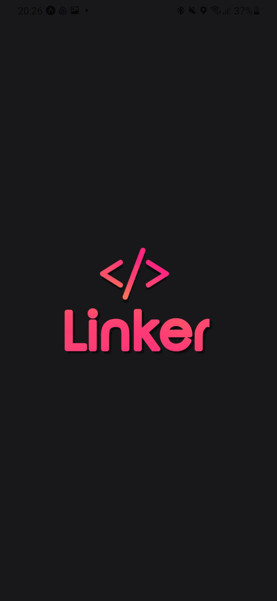
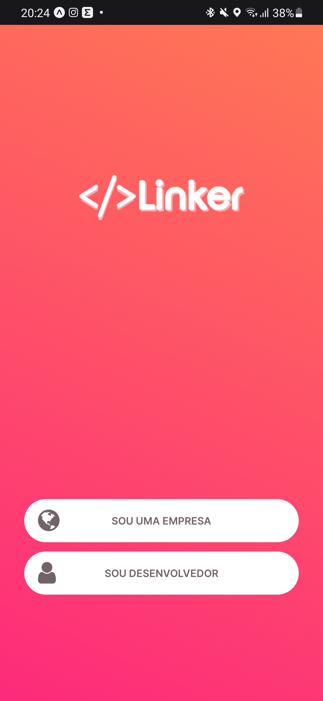

<h1>
  
  Linker
</h1>

<h2>Screenshots</h2>

<em>*Será atualizado ao longo do desenvolvimento</em>

    
    

<h2>Sobre o projeto</h2>

Este projeto esta sendo desenvolvido como trabalho da disciplina Projeto e Desenvolvimento de Sistemas 2 da Univerdade Federal de Rio Grande.
A ideia deste projeto é desenvolver um clone do aplicativo Tinder com o objetivo de conectar desenvolvedores a empresas, e assim, facilitar para as empresas no processo de seleção para entrevistas de emprego, assim como para os desenvolvedores, que poderão buscar novas oportunidades de emprego em um ambiente mais interativo.

<h2>Usuários | Público Alvo</h2>
<h3>Empresas com Vagas de Tecnologia</h3>

Um usuário que poderá criar um perfil, e dentro deste perfil criar vagas de emprego e pequenos testes para a devida vaga. Ela vai ser responsável pela leitura e aprovação dos testes, a aprovação é a condição para o match com o desenvolvedor para marcar uma entrevista.

<h3>Desenvolvedores que Buscam Emprego</h3>

Um usuário que poderá criar um perfil com seu "currículo" e curtir vagas de emprego e realizar os seus respectivos testes. Quando a empresa aprovar o desenvolvedor no teste, dará ‘match’. O que permitirá que a empresa possa marcar uma entrevista de emprego com este desenvolvedor.

